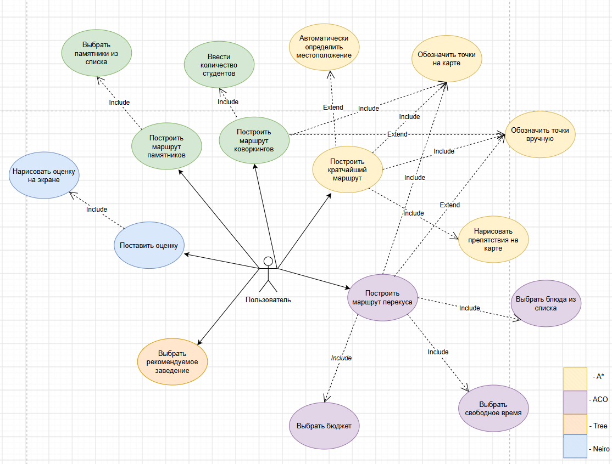

# TSUmaps — навигатор Университетской рощи ТГУ

Мобильное приложение для студентов Томского государственного университета: помогает ориентироваться в роще, подбирать заведения для еды и коворкинги, а также демонстрирует собственные реализации алгоритмов приближённых вычислений с их визуализацией.

**Платформа:** Android · **Минимальная версия:** Android 7.0+

---

## Содержание

- [1. О проекте](#1-о-проекте)
  - [1.1. Наименование системы](#11-наименование-системы)
  - [1.2. Границы проекта](#12-границы-проекта)
- [2. Цели и критерии успеха](#2-цели-и-критерии-успеха)
- [3. Глоссарий](#3-глоссарий)
- [4. Пользователи и роли](#4-пользователи-и-роли)
  - [4.1. Use Case](#41-use-case)
  - [4.2. Персоны](#42-персоны)
- [5. Общее описание системы](#5-общее-описание-системы)
  - [5.1. Архитектурная концепция](#51-архитектурная-концепция)
  - [5.2. Карта экранов](#52-карта-экранов)
- [6. Требования к подготовке ресурсов](#6-требования-к-подготовке-ресурсов)
- [7. Функциональные требования](#7-функциональные-требования)
  - [7.1. A\*](#71-a)
  - [7.2. Кластеризация объектов кампуса](#72-кластеризация-объектов-кампуса)
  - [7.3. Генетический алгоритм: маршрут покупки еды](#73-генетический-алгоритм-маршрут-покупки-еды)
  - [7.4. Муравьиный алгоритм](#74-муравьиный-алгоритм)
  - [7.5. Дерево решений](#75-дерево-решений-завтрак-обед-ужин)
  - [7.6. Нейросеть](#76-нейро-оценка-заведения-рисованием-цифры)
- [8. Модель данных](#8-модель-данных)
- [9. Нефункциональные требования](#9-нефункциональные-требования)

---

## 1. О проекте

### 1.1. Наименование системы

Полное наименование: мобильное приложение **«TSUmaps»** (Навигатор ТГУ).
Краткое наименование: **TSUmaps**.

### 1.2. Границы проекта

**Входит в объём работ:**

- Клиентское Android-приложение с шестью функциональными разделами.
- Собственные реализации алгоритмов: A\*, K-means, DBSCAN, генетический алгоритм, муравьиный алгоритм (ACO), ID3-дерево решений, однослойная нейронная сеть-классификатор.
- Подготовка растровой разметки территории и её преобразование в матрицу проходимости.
- Визуализация работы алгоритмов на карте кампуса.

**Не входит в объём работ:**

- Серверная часть, backend-API, синхронизация между устройствами.
- Регистрация, авторизация, пользовательские профили.
- Онлайн-картография (тайлы 2GIS/Google Maps в рантайме), онлайн-меню заведений.
- iOS-версия, планшетная и ландшафтная адаптация.

---

## 2. Цели и критерии успеха

### 2.1. Бизнес-цели

| ID | Цель |
|---|---|
| BG-1 | Дать студенту ТГУ практическую пользу: маршрут по кампусу, подбор точки питания, подбор рабочего места |
| BG-2 | Обеспечить наглядную визуализацию выбора построения маршрута, промежуточный результат |
| BG-3 | Продемонстрировать корректно работающие собственные реализации алгоритмов приближённых вычислений |

### 2.2. Цели создания системы

| ID | Цель |
|---|---|
| SG-1 | Построение пешеходного маршрута между двумя точками рощи с учётом реальной проходимости |
| SG-2 | Группировка объектов кампуса на зоны с сопоставлением разных метрик расстояния |
| SG-3 | Построение маршрута покупки набора блюд с учётом меню и режима работы заведений |
| SG-4 | Построение обзорного маршрута по достопримечательностям и распределение группы студентов по коворкингам |
| SG-5 | Рекомендация места обеда по признакам ситуации с объяснением пути решения |
| SG-6 | Ввод оценки заведения через распознавание нарисованной цифры в отведённом для этого окне |

### 2.3. Критерии успеха

- Все шесть разделов приложения работают на устройстве с Android 7.0+ без падений на сценариях приёмки.
- Для каждого алгоритма реализована визуализация промежуточного состояния (кроме дерева решений и нейросети, где визуализируется структура и результат).

---

## 3. Глоссарий

| Термин | Значение |
|---|---|
| Роща | Университетская роща ТГУ и прилегающая территория — область покрытия приложения |
| Маска карты | Растровое изображение территории, где светлые пиксели соответствуют проходимым участкам |
| Матрица проходимости | Двумерный массив ячеек 0/1, полученный из маски карты |
| Ячейка | Элемент матрицы проходимости; сторона — 8 пикселей исходного растра |
| Проходимая ячейка | Ячейка со значением 1; по ней возможно перемещение пешехода |
| Препятствие | Ячейка со значением 0: здание, внутреннее помещение, газон, водоём |
| Ограждение | Пользовательское препятствие, нанесённое пальцем поверх карты в режиме рисования |
| A\* | Эвристический алгоритм поиска кратчайшего пути на графе |
| ACO | Ant Colony Optimization — муравьиный алгоритм |
| ГА | Генетический алгоритм |
| Особь / геном | Кандидат-решение в ГА: последовательность идентификаторов заведений |
| Фитнес | Оценка качества особи; в системе минимизируется |
| Феромон | Числовой след на ребре графа, накапливаемый муравьями |
| Лист дерева | Терминальный узел дерева решений, содержащий итоговую рекомендацию |
| Заведение (Venue) | Точка интереса: точка питания, коворкинг или достопримечательность |

---

## 4. Пользователи и роли

### 4.1. Use Case

Каждый цвет — отдельный интерфейс (вкладка): жёлтый — A\*, фиолетовый — ACO, оранжевый — дерево решений, синий — нейросеть.

### 4.2. Персоны

| Персона | Цель | Боль |
|---|---|---|
| **П-1.** Студент, 1 курс | Не ориентируется в роще, опаздывает на пары. Быстро понять, как дойти от текущего места до нужной точки | Карта 2GIS показывает маршрут по улицам, а не по внутренним дорожкам рощи |
| **П-2.** Студент, старший курс | Между парами есть 25 минут — купить кофе, блины и одноразовую посуду за минимальное время | Приходится самой держать в голове меню и часы работы нескольких заведений |
| **П-3.** Студент-староста | Организует групповую подготовку к экзамену для 30 человек — распределить группу по коворкингам с учётом вместимости и удалённости | Вручную обзванивает читальные залы |
| **П-4.** Гость университета | Первый раз в роще, хочет обойти памятники и скульптуры по обзорному маршруту | — |

---

## 5. Общее описание системы

### 5.1. Архитектурная концепция

| Слой | Назначение | Пакет |
|---|---|---|
| **UI** | Экраны, панели, отрисовка карты и анимаций | `ui.screens`, `ui.components` |
| **Features** (координация) | Подготовка входных данных для алгоритмов, кэширование графа, геолокация | `features.path`, `features.clustering` |
| **Algorithms** | Чистые реализации алгоритмов, не зависящие от Android SDK | `algorithms` |
| **Data** | Матрица проходимости, справочники заведений и блюд, преобразование координат | `data.map`, `data.venues` |

> **ARCH-1.** Модули слоя `algorithms` не должны иметь зависимостей от Android-классов (`Context`, `Bitmap`, `Compose`), чтобы допускать модульное тестирование на JVM.
>
> **ARCH-2.** Все вычисления алгоритмов выполняются вне главного потока (корутины, диспетчер `Default`); UI-поток используется только для отрисовки.
>
> **ARCH-3.** Долгие циклы алгоритмов должны периодически уступать поток (`yield`), чтобы обновление визуализации происходило во время работы алгоритма, а не только по его завершении.

### 5.2. Карта экранов

Экраны соответствуют шести функциональным модулям, описанным в разделе [7. Функциональные требования](#7-функциональные-требования): A\*, кластеризация, генетический алгоритм, муравьиный алгоритм, дерево решений и нейросеть — каждый доступен отдельной вкладкой нижней навигации.

---

## 6. Требования к подготовке ресурсов

### 6.1. Разметка территории

**RES-1.** Карта Университетской рощи и прилегающих территорий берётся из геоинформационной системы (2GIS / Google Maps) и вручную размечается в два растровых слоя:

- `map_original` — визуальная подложка, отображаемая пользователю;
- `map_mask` — маска проходимости, где светлые области соответствуют проходимым участкам, тёмные — препятствиям.

**RES-2.** Препятствиями считаются здания (включая внутренние помещения), газоны, клумбы и водные объекты.

**RES-3.** Все реально существующие дорожки на маске должны быть непрерывно проходимы: маршрут между любыми двумя точками сети дорожек должен существовать. Проверяется прогоном A\* между крайними точками рощи.

### 6.2. Преобразование маски в матрицу

**RES-4.** Маска разбивается на квадратные ячейки со стороной 8 пикселей.

**RES-5.** Ячейка считается проходимой (значение 1), если хотя бы один её пиксель имеет среднюю яркость по каналам RGB выше 180; иначе — препятствие (значение 0).

**RES-6.** Обращение к ячейке за пределами матрицы возвращает «препятствие» и не приводит к исключению.

**RES-7.** После построения матрицы растр маски выгружается из памяти.

**RES-8.** Если результат преобразования попадает в непроходимую ячейку, система подбирает ближайшую проходимую ячейку поиском по расширяющемуся радиусу.

---

## 7. Функциональные требования

### 7.1. A\*

Функциональные требования (13)

| ID | Требование | Приоритет |
|---|---|---|
| FR-NAV-01 | Пользователь может выбрать касанием по карте начальную точку A и конечную точку B | 🔴 Критично |
| FR-NAV-02 | Если касание пришлось на непроходимую ячейку, точка автоматически смещается в ближайшую проходимую ячейку | 🔴 Критично |
| FR-NAV-03 | Точки A и B отображаются маркерами разного цвета (красный — старт, синий — цель) с легендой | 🔴 Критично |
| FR-NAV-04 | Доступна операция обмена точек A и B местами | 🔴 Критично |
| FR-NAV-05 | Доступен сброс всех выбранных точек, построенного маршрута и нанесённых ограждений | 🟡 Желательно |
| FR-NAV-06 | По команде «Построить путь» запускается поиск пути алгоритмом A\* | 🔴 Критично |
| FR-NAV-07 | Если маршрут не существует, выводится сообщение об отсутствии пути | 🔴 Критично |
| FR-NAV-08 | Найденный маршрут отображается ломаной линией поверх карты | 🔴 Критично |
| FR-NAV-09 | Пользователь может включить режим рисования и нанести пальцем дополнительные ограждения; линия преобразуется в набор непроходимых ячеек | 🟡 Желательно |
| FR-NAV-10 | Нанесённые ограждения учитываются при следующем запуске поиска и могут быть очищены отдельной командой | 🟡 Желательно |
| FR-NAV-11 | В процессе работы алгоритма в реальном времени отображается анимация поиска: рассмотренные ячейки, ячейки открытого множества и текущий восстанавливаемый путь | 🔴 Критично |
| FR-NAV-12 | Приложение может определить текущее геопозиционирование пользователя и использовать его как точку A | 🔴 Критично |
| FR-NAV-13 | При отсутствии разрешения на геолокацию, отключённой геолокации или позиции за пределами кампуса выводится соответствующий статус, и пользователю предлагается выбрать старт вручную | 🔴 Критично |

Алгоритмические требования (7)

| ID | Требование |
|---|---|
| ALG-NAV-01 | Соседство ячеек — восьмисвязное (4 прямых и 4 диагональных перехода) |
| ALG-NAV-02 | Стоимость прямого перехода — 1.0, диагонального — 1.4 |
| ALG-NAV-03 | Эвристика — евклидово расстояние до цели |
| ALG-NAV-04 | Пользовательские ограждения трактуются как непроходимые ячейки наравне с ячейками маски |
| ALG-NAV-05 | Поиск ограничен по времени; при превышении лимита в 6 секунд поиск прерывается со статусом «путь не найден или превышен лимит» |
| ALG-NAV-06 | Алгоритм предоставляет наружу промежуточное состояние поиска (просмотренные и открытые узлы) для визуализации |
| ALG-NAV-07 | Помимо потокового режима должен быть доступен синхронный режим вызова поиска — он используется другими модулями как метрика расстояния |

### 7.2. Кластеризация объектов кампуса

Функциональные требования (8)

| ID | Назначение | Приоритет |
|---|---|---|
| FR-CLU-01 | Точки кластеризации берутся из встроенного справочника заведений с их координатами на карте | 🔴 Критично |
| FR-CLU-02 | Пользователь может отфильтровать точки по типу: все / точки питания / рабочие зоны / достопримечательности | 🔴 Критично |
| FR-CLU-03 | Пользователь может выбрать алгоритм кластеризации: K-means или DBSCAN | 🔴 Критично |
| FR-CLU-04 | Для K-means пользователь задаёт количество кластеров | 🔴 Критично |
| FR-CLU-05 | Для DBSCAN используются фиксированные параметры плотности, о чём пользователь информируется в интерфейсе | 🔴 Критично |
| FR-CLU-06 | Пользователь может выбрать метрику расстояния: евклидова («по прямой») или пешеходная по дорожкам через A\* («по дорожкам») | 🟡 Желательно |
| FR-CLU-07 | Результат отображается на карте: точки окрашиваются в цвет своего кластера | 🔴 Критично |
| FR-CLU-08 | Доступен режим сравнения метрик: система выполняет кластеризацию дважды — по евклидовой и по пешеходной метрике — и выделяет точки, попавшие в разные кластеры, с указанием принадлежности по каждой метрике | 🟡 Желательно |

Алгоритмические требования (5)

| ID | Требование |
|---|---|
| ALG-CLU-01 | K-means: начальные центроиды выбираются из числа исходных точек; итерации выполняются до сходимости центроидов или до достижения предела в 1000 итераций |
| ALG-CLU-02 | K-means: пустой кластер сохраняет прежний центроид и не приводит к ошибке деления |
| ALG-CLU-03 | DBSCAN: точка считается ядровой при наличии не менее 4 соседей в радиусе eps; кластер расширяется обходом достижимых по плотности точек |
| ALG-CLU-04 | DBSCAN: точки, не отнесённые ни к одному кластеру, выделяются как одиночные и отображаются отдельно |
| ALG-CLU-05 | Пешеходная метрика вычисляет расстояние как стоимость пути A\* между ближайшими проходимыми ячейками; при отсутствии пути возвращается бесконечность |

### 7.3. Генетический алгоритм: маршрут покупки еды

Решение модифицированной задачи коммивояжёра: собрать выбранный набор блюд, посетив только необходимые заведения, за минимальное время, с учётом ассортимента и режима работы.

Функциональные требования (8)

| ID | Назначение | Приоритет |
|---|---|---|
| FR-GEN-01 | Пользователь выбирает нужные позиции из каталога блюд и товаров, сгруппированного по категориям: завтрак, обед, ужин, напитки, перекусы, сервис и упаковка | 🔴 Критично |
| FR-GEN-02 | Точкой старта маршрута является заданная стартовая позиция на карте | 🔴 Критично |
| FR-GEN-03 | После нажатия кнопки запускается генетический алгоритм построения маршрута | 🔴 Критично |
| FR-GEN-04 | Во время работы алгоритма на карте отображается лучшая особь текущего поколения: маршрут, номер поколения из общего числа, суммарное время и число остановок | 🔴 Критично |
| FR-GEN-05 | Отображается поминутное расписание: для каждой остановки — заведение, время прибытия и выхода, минуты от старта, список приобретаемых там позиций, режим работы заведения | 🔴 Критично |
| FR-GEN-06 | Если часть позиций недоступна (нет в меню открытых заведений), они перечисляются отдельным списком «не найдено» | 🔴 Критично |
| FR-GEN-07 | Попытка запуска без выбранных позиций блокируется с поясняющим сообщением | 🔴 Критично |
| FR-GEN-08 | Доступна очистка выбора и результата | 🔴 Критично |

Алгоритмические требования (7)

| ID | Требование |
|---|---|
| ALG-GEN-01 | Особь — перестановка идентификаторов заведений; при декодировании посещаются только те заведения, которые дают ещё не собранные позиции, обход прекращается при сборе полного набора |
| ALG-GEN-02 | Матрица попарных времён перехода между стартом и всеми заведениями строится заранее по пешеходным путям A\* и переиспользуется всеми поколениями |
| ALG-GEN-03 | Скорость пешехода принимается равной 5 км/ч; на каждую остановку добавляется фиксированное время обслуживания 4 минуты |
| ALG-GEN-04 | Текущее время суток берётся с устройства и используется как момент старта |
| ALG-GEN-05 | Заведение доступно, если время прибытия попадает в интервал его работы; посещение закрытого заведения штрафуется |
| ALG-GEN-06 | Премия за срочность тем выше, чем меньше времени остаётся до закрытия заведения на момент прибытия (заведения, закрывающиеся скоро, получают более высокий приоритет) |
| ALG-GEN-07 | После каждого поколения наружу передаётся лучшая особь для визуализации; итоговый результат — лучшая особь последнего поколения |

### 7.4. Муравьиный алгоритм

Обход достопримечательностей и распределение по коворкингам. Модуль имеет два режима, переключаемых пользователем.

Режим 1 — обход достопримечательностей (7)

| ID | Требование | Приоритет |
|---|---|---|
| FR-ANT-01 | Точка старта определяется автоматически по геопозиции пользователя | 🟡 Желательно |
| FR-ANT-02 | При недоступности геопозиции или её положении вне карты пользователь задаёт старт касанием по карте; статус информирует о причине | 🔴 Критично |
| FR-ANT-03 | Пользователь выбирает интересующие достопримечательности из списка | 🔴 Критично |
| FR-ANT-04 | Требуется выбрать не менее двух достопримечательностей; иначе запуск блокируется с сообщением | 🔴 Критично |
| FR-ANT-05 | После нажатия кнопки запуска строится замкнутый маршрут обхода выбранных точек муравьиным алгоритмом | 🔴 Критично |
| FR-ANT-06 | Маршрут отображается на карте; выводится его длина | 🔴 Критично |
| FR-ANT-07 | Отрезки маршрута между точками прокладываются по проходимым дорожкам, а не по прямой | 🔴 Критично |

Режим 2 — распределение по коворкингам (6)

| ID | Требование | Приоритет |
|---|---|---|
| FR-ANT-08 | Пользователь вводит количество студентов, которым нужно работать вместе | 🔴 Критично |
| FR-ANT-09 | Некорректный ввод (не число, ноль, отрицательное значение) отклоняется с сообщением | 🔴 Критично |
| FR-ANT-10 | Кандидатами являются локации типа «рабочая зона» с известной вместимостью: коворкинги, читальные залы, свободные аудитории | 🔴 Критично |
| FR-ANT-11 | Муравьиный алгоритм распределяет поток студентов между локациями с учётом длины пути, вместимости локации и числа муравьёв, уже выбравших маршрут | 🔴 Критично |
| FR-ANT-12 | Результат выводится списком: локация, число направленных туда студентов, расстояние; дополнительно отображается суммарная длина путей | 🔴 Критично |
| FR-ANT-13 | Если пригодных локаций нет, выводится поясняющее сообщение | 🔴 Критично |

Алгоритмические требования (4)

| ID | Требование |
|---|---|
| ALG-ANT-01 | Граф полный: вершины — старт и выбранные точки, рёбра взвешены пешеходным расстоянием, рассчитанным через выбранную метрику |
| ALG-ANT-02 | После каждой итерации феромон испаряется с заданным коэффициентом, затем муравьи откладывают феромон обратно пропорционально длине пройденного маршрута |
| ALG-ANT-03 | Целевая функция распределения учитывает суммарную длину путей и штраф за превышение вместимости локации; муравьи не знают заранее расположения оптимальных локаций и находят их, накапливая феромон |
| ALG-ANT-04 | Траектории муравьёв по итерациям сохраняются для последующей визуализации |

### 7.5. Дерево решений: завтрак, обед, ужин

Рекомендация точки питания по признакам ситуации с наглядным объяснением, по каким веткам дерева было принято решение.

Функциональные требования (12)

| ID | Требование | Приоритет |
|---|---|---|
| FR-DTR-01 | Приложение содержит встроенную обучающую выборку в формате CSV и строит по ней дерево решений при открытии экрана | 🔴 Критично |
| FR-DTR-02 | Пользователь может ввести собственную обучающую выборку CSV-текстом: первая строка — заголовки столбцов, последний столбец — целевой признак | 🔴 Критично |
| FR-DTR-03 | При ошибке разбора CSV выводится сообщение об ошибке; ранее построенное дерево остаётся работоспособным | 🔴 Критично |
| FR-DTR-04 | Построенное дерево визуализируется в виде схемы, разворачиваемой и сворачиваемой пользователем | 🔴 Критично |
| FR-DTR-05 | Отображается статистика: число примеров в выборке и число узлов в дереве | 🔴 Критично |
| FR-DTR-06 | Пользователь отвечает на вопросы по признакам своей ситуации, выбирая значения из вариантов, встреченных в выборке | 🔴 Критично |
| FR-DTR-07 | По команде система прогоняет ответы по дереву и показывает рекомендованное заведение | 🔴 Критично |
| FR-DTR-08 | Отображается путь по узлам дерева: последовательность вопросов и выбранных ветвей, приведших к листу | 🔴 Критично |
| FR-DTR-09 | Если признак не задан или комбинация не встречалась в выборке, система выдаёт запасной вариант (наиболее частый класс в поддереве) с явным предупреждением | 🔴 Критично |
| FR-DTR-10 | Для рекомендованного заведения доступна команда «Открыть на карте кампуса»: происходит переход на вкладку «Карта» с отметкой заведения как конечной точки | 🔴 Критично |
| FR-DTR-11 | Если для метки нет соответствующей точки на карте, выводится поясняющее сообщение вместо перехода | 🔴 Критично |
| FR-DTR-12 | Доступно текстовое представление дерева для включения в отчёт | 🟡 Желательно |

Алгоритмические требования (5)

| ID | Требование |
|---|---|
| ALG-DTR-01 | Дерево строится алгоритмом ID3: на каждом шаге выбирается признак с максимальным приростом информации, вычисляемым через энтропию Шеннона |
| ALG-DTR-02 | Ветвление прекращается, если все примеры в узле имеют один класс, если признаки исчерпаны или если достигнут предел глубины; в этом случае создаётся лист с мажоритарным классом |
| ALG-DTR-03 | Предсказание возвращает не только метку, но и последовательность пройденных узлов с выбранными значениями, а также флаги «признак не задан» и «комбинация не встречалась» |
| ALG-DTR-04 | Парсер CSV корректно обрабатывает пустые строки, лишние пробелы и значения в кавычках; при несовпадении числа столбцов со строкой заголовков возвращается ошибка с описанием |
| ALG-DTR-05 | Упрощение дерева склеивает внутренние узлы, все ветви которых ведут к листьям с одинаковой меткой, заменяя поддерево одним листом; результат должен быть эквивалентен исходному по предсказаниям |

### 7.6. Нейро: оценка заведения рисованием цифры

Функциональные требования (6)

| ID | Требование | Приоритет |
|---|---|---|
| FR-NRL-01 | Пользователь выбирает заведение из списка точек питания | 🔴 Критично |
| FR-NRL-02 | Отображается сетка 5 × 5 (25 ячеек); касание ячейки переключает её состояние между закрашенным и пустым | 🔴 Критично |
| FR-NRL-03 | По мере рисования нейронная сеть распознаёт изображённую цифру и выводит её пользователю | 🔴 Критично |
| FR-NRL-04 | Распознанная цифра сохраняется как оценка выбранного заведения в диапазоне 0…9 | 🔴 Критично |
| FR-NRL-05 | Доступна очистка холста | 🔴 Критично |
| FR-NRL-06 | Если закрашено менее 3 ячеек или уверенность классификации ниже порога 0.40, результат не выводится (вместо цифры отображается прочерк) | 🔴 Критично |

Алгоритмические требования (5)

| ID | Требование |
|---|---|
| ALG-NRL-01 | Вход сети — вектор из 25 значений, полученный из состояния ячеек сетки |
| ALG-NRL-02 | Сеть — однослойный классификатор на 10 классов: линейная комбинация входов с весами и смещением для каждого класса |
| ALG-NRL-03 | Выход нормализуется функцией softmax в распределение вероятностей; в реализации используется вычитание максимума для численной устойчивости |
| ALG-NRL-04 | Результат — класс с максимальной вероятностью и значение этой вероятности как уверенность |
| ALG-NRL-05 | Веса модели обучаются вне приложения на подготовленной выборке начертаний цифр 5 × 5 и включаются в сборку как константы; обучение в рантайме не выполняется |

---

## 8. Модель данных

### 8.1. Основные сущности

**MapData** — матрица проходимости

| Атрибут | Тип | Описание |
|---|---|---|
| `matrix` | `arr<arr<int>>` | значения 0 (препятствие) / 1 (проходимо) |
| `width` | `int` | число ячеек по горизонтали |
| `length` | `int` | число ячеек по вертикали |

**Venue** — точка интереса (достопримечательности, коворкинги)

| Атрибут | Тип | Описание |
|---|---|---|
| `id` | `int` | уникальный идентификатор |
| `name` | `string` | отображаемое название |
| `x, y` | `int` | координаты в матрице |
| `type` | `enum` | `FOOD` / `COWORKING` / `SIGHTSEEING` |
| `capacity` | `int` | вместимость (для рабочих зон) |
| `userRating` | `int` | оценка пользователя (0–9) |

**FoodVenue** — точка питания для маршрутизации

| Атрибут | Тип | Описание |
|---|---|---|
| `id` | `int` | уникальный идентификатор |
| `name` | `string` | отображаемое название |
| `point` | `GeoPoint` | координаты в километрах для расчёта времени |
| `mapPosition` | `arr<int>` | позиция для отрисовки |
| `menu` | `arr<FoodItem>` | ассортимент заведения |
| `openFromMinutes` / `closeAtMinutes` | `int` | режим работы в минутах от начала суток |
| `userRating` | `int` | оценка пользователя |

### 8.2. Связи

- `Venue` типа `COWORKING` участвует в распределении студентов; ограничение — `capacity` должна быть задана.
- `Venue` типа `SIGHTSEEING` участвует в построении обзорного маршрута.
- `FoodVenue.menu` определяет, какие `FoodItem` можно приобрести в заведении; на этом строится ограничение генетического алгоритма.
- Метка листа дерева решений сопоставляется с точкой на карте через справочник соответствий; отсутствие соответствия обрабатывается по FR-DTR-11.

---

## 9. Нефункциональные требования

9.1. Производительность (6)

| ID | Требование |
|---|---|
| NFR-PERF-01 | Построение матрицы проходимости при старте — не более 3 секунд на устройстве среднего класса |
| NFR-PERF-02 | Поиск маршрута A\* — не более 6 секунд; по истечении лимита поиск принудительно прерывается с сообщением пользователю |
| NFR-PERF-03 | Кластеризация по евклидовой метрике — не более 2 секунд; по пешеходной метрике допускается до 15 секунд с обязательным индикатором прогресса |
| NFR-PERF-04 | Генетический алгоритм при 160 поколениях — не более 20 секунд, при этом промежуточный результат должен обновляться на экране не реже одного раза в секунду |
| NFR-PERF-05 | Распознавание цифры — не более 100 мс, результат обновляется синхронно с рисованием |
| NFR-PERF-06 | Интерфейс не должен блокироваться: ни один расчёт не выполняется в главном потоке |

9.2. Надёжность и обработка ошибок (4)

| ID | Требование |
|---|---|
| NFR-REL-01 | Ошибка загрузки карты не приводит к аварийному завершению; выводится сообщение с предложением перезапустить экран |
| NFR-REL-02 | Отсутствие пути, пустой выбор, некорректный ввод числа студентов и ошибка разбора CSV обрабатываются сообщениями в статусной строке, а не исключениями |
| NFR-REL-03 | Отсутствие разрешения на геолокацию или отключённая геолокация не блокируют работу модулей: доступен ручной выбор точек |
| NFR-REL-04 | Приложение полностью работоспособно без доступа к сети |

9.4. Безопасность и приватность (4)

| ID | Требование |
|---|---|
| NFR-SEC-01 | Приложение запрашивает только разрешения `ACCESS_FINE_LOCATION`, `ACCESS_COARSE_LOCATION` и `INTERNET` |
| NFR-SEC-02 | Разрешение на геолокацию запрашивается в момент первой попытки использования функции, а не при старте приложения |
| NFR-SEC-03 | Координаты пользователя используются только в памяти на время сессии, не сохраняются и не передаются за пределы устройства |
| NFR-SEC-04 | Персональные данные не собираются; учётные записи отсутствуют |

9.5. Требования к интерфейсу (8)

| ID | Требование |
|---|---|
| NFR-UI-01 | Оформление ориентируется на фирменный стиль ТГУ: логотип университета, фирменные синий и золотой цвета в акцентах, светлый фон |
| NFR-UI-02 | При запуске отображается заставка с логотипом ТГУ и анимированным индикатором загрузки длительностью около 3 секунд |
| NFR-UI-03 | Нижняя панель навигации содержит шесть вкладок с иконкой и кратким текстовым названием |
| NFR-UI-04 | Каждый экран алгоритма содержит статусную строку, отражающую текущее состояние и следующее ожидаемое действие пользователя |
| NFR-UI-05 | На каждой карте с результатом присутствует легенда, поясняющая значение цветов маркеров и линий |
| NFR-UI-06 | Все пользовательские тексты выносятся в строковые ресурсы; жёстко зашитые строки в коде интерфейса не допускаются |
| NFR-UI-07 | Для значимых изображений и иконок задаётся описание содержимого для программ экранного доступа |
| NFR-UI-08 | Управляющие элементы — не менее 48 dp по каждой стороне |

